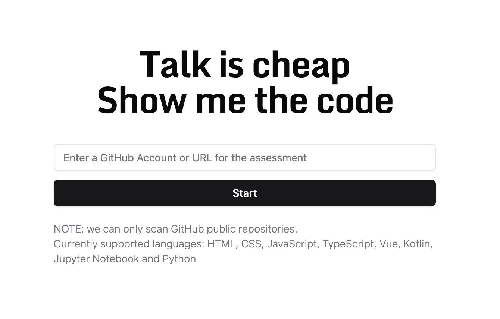
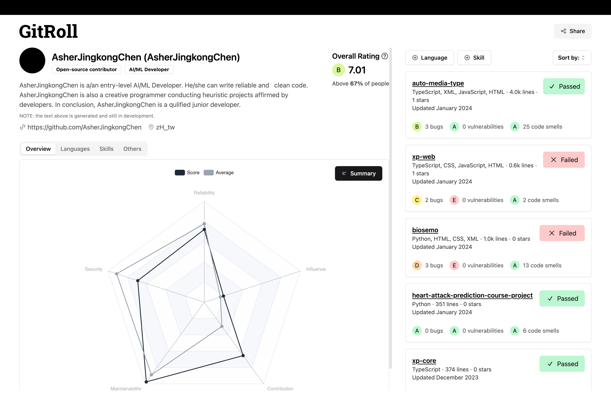
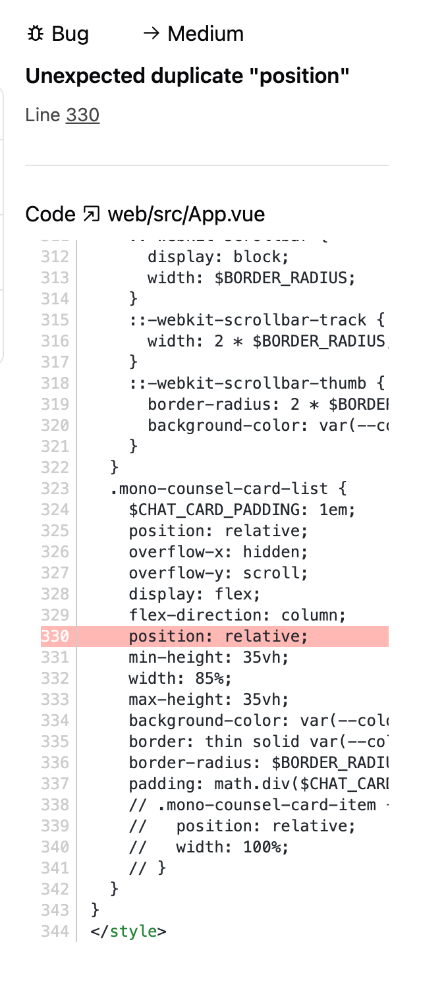
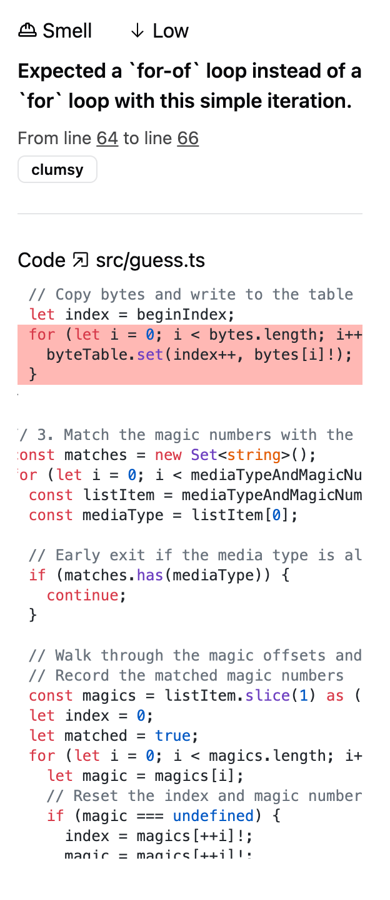
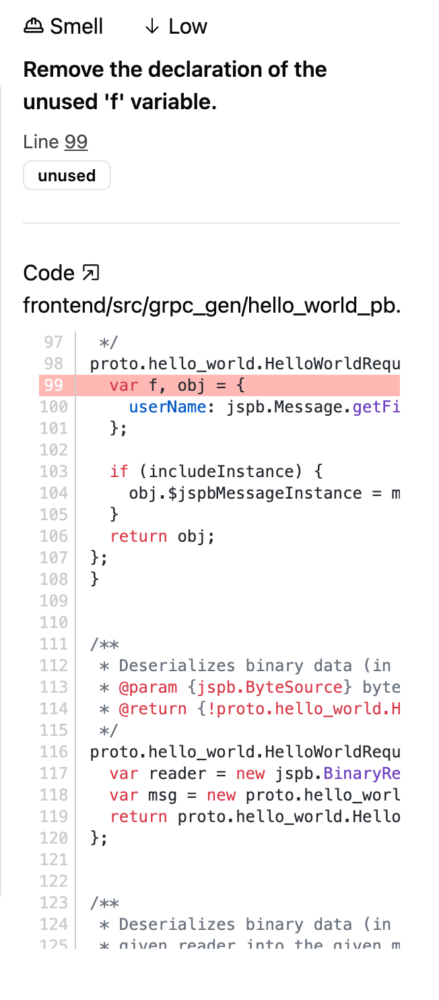

# My experience of GitRoll

## What is GitRoll?

A skill assessment tool for GitHub repositories.

The link: [GitRoll](https://gitroll.com/)

## How I use GitRoll?

1. Go to the Home page and click on `Scan a GitHub`.

   

2. Enter my GitHub repository [URL](https://github.com/AsherJingkongChen) and click on `Start`.

   

3. After the scan is done, I can see my skill overview page.

   

4. Click the title of a result card to see the details. Let's take a look at this `failed` card.

   

5. The detail page shows information including: `Repository Name and URL`, `Lines of Code`, `Stars`, `Last Updated Time`, `Languages`, `Skills`, `Reliability`, `Security`, `Maintainability`, `Issues`.

   

6. Click one of `Bug` issue: `Unexpected duplicate "position"`. We can see the number of line is `330`. This would cause unexpected layout of an HTML element.

   

7. See [More Cases](#more-cases) for more.

## More Cases

1. [AsherJingkongChen/biosemo](https://github.com/AsherJingkongChen/biosemo/tree/21d69f9b6933d5d9d713c084d37b2afed1098707)
   1. `Bug - High`: Remove all characters located before `"<?xml"`.
      - According to the [XML specification](https://www.w3.org/TR/xml/#NT-prolog), this is not a valid XML file. This issue is correct. However, this severity should not be `High`. Some implementations may ignore the characters before `"<?xml"` and parse the XML file correctly. This issue should be `Medium`. Futhurmore, this XML file is not crucial to the project.

         

   2. `Smell - Medium`: Remove this commented out code.
      - These are needed in practice.

         

2. [AsherJingkongChen/auto-media-type](https://github.com/AsherJingkongChen/auto-media-type/tree/0a1e74616cf419ea88f3321a04a2a2cba83644a7)
   1. `Smell - Low`: Expected a `for-of` loop instead of a `for` loop with this simple iteration.
      - Better to use `for` loop for higher throughput. See this benchmark result: [for-of vs for](https://www.measurethat.net/Benchmarks/Show/12139/0/for-vs-foreach-vs-forof-vs-forof-over-entries).

         

3. [AsherJingkongChen/xp-web](https://github.com/AsherJingkongChen/xp-web/tree/2d109b592c0fb80a0d5ade48a75b73e287cb6a4a)
   1. `Smell - Medium`: Unnecessary escape character: `\/`.
      - Yes, it is unnecessary and has no effect.

         

   2. `Bug - Medium`: Add a `<title>` tag to this page.
      - According to the [HTML specification](https://html.spec.whatwg.org/#the-title-element), the `title` element is not omissible. However, this file is the HTML template for `Svelte`, a web framework like `Vue`. A `<title>` tag will be interpolated by `Svelte` in SSR/SSG phase.

         

4. [AsherJingkongChen/hello-world-grpc-web](https://github.com/AsherJingkongChen/hello-world-grpc-web/tree/d0dafc7ad1333a9aadfcfb2d346e71f9a0b7b462)
    1. `Smell - Low/Medium`: Remove the unused parameter/variable.
       - Generated codes by `protoc` are not perfect. This is a common issue.

         
         

    2. `Smell - High`: Unexpected var, use let or const instead.
       - A generated codes common issue.

         

5. [AsherJingkongChen/codeslide](https://github.com/AsherJingkongChen/codeslide/tree/475673a423cf2a45bb4381342c83f1aef550819b)
    1. `Smell - Low`: Prefer using nullish coalescing operator (`??`) instead of a logical or (`||`), as it is a safer operator.
       - This is needed in practice. We need to make `"" || "plaintext"` to return `"plaintext"`.

         

6. [antfu/vitesse](https://github.com/antfu/vitesse/tree/c5d5425e92a0238ab186202e7be858dfdc708329)
   1. `Bug - Medium`: Add a `<title>` tag to this page.
      - According to the [HTML specification](https://html.spec.whatwg.org/#the-title-element), the `title` element is not omissible. However, this file is the HTML template for `Vue`, a web framework like `Angular`. A `<title>` tag will be interpolated by `Vue` in SSG phase.

         

7. [antfu/vite-ssg](https://github.com/antfu/vite-ssg/tree/7ef969c0e8e96e0dd4915f8c9aacb006a94e7a9d)
   1. `Bug - Medium`: Expected an assignment or function call and instead saw an expression.
      - This is the API design of `yargs` (Global builder), a CLI argument parser. On the other hand, there is an `eslint-disable` banner on the first line, which tells `eslint` to ignore any unused expression.

         

8. [101arrowz/fflate](https://github.com/101arrowz/fflate/tree/ef157f096c70c43187323c341a9bfb956e29ae83)
   1. `Bug - Medium`: Remove this use of the output from `"wbytes"`; `"wbytes"` doesn't return anything.
      - This is neither a bug nor a smell. This function returns `void`, and its output is not used. This is a false issue.

         

   2. `Bug - High`: `'l'` is not defined in this loop.
      - `l` is defined in the outer scope (the fifth parameter of `e`). This is a false issue.

         

   3. `Smell - High`: Unexpected var, use let or const instead. (xN)
      - A generated codes common issue.

         

## Conclusion

It is an AI tool. It is not perfect but good enough to use.

## Reference

*NOTE: Links may be invalid in the future. I do not have any archive of them*

1. [GitRoll](https://gitroll.com/)
2. [GitRoll - AsherJingkongChen](https://gitroll.io/result/repo/FevbnNdjfLngxgxfa13w)
2. [GitRoll - antfu](https://gitroll.io/result/I5NtrMd9HajJmAKvsfFF)
2. [GitRoll - 101arrowz](https://gitroll.io/result/Srn70srH03XhHA7R3EyC)

## Declaimer

All the information is public. These documents and images are assets of Public Domain.
